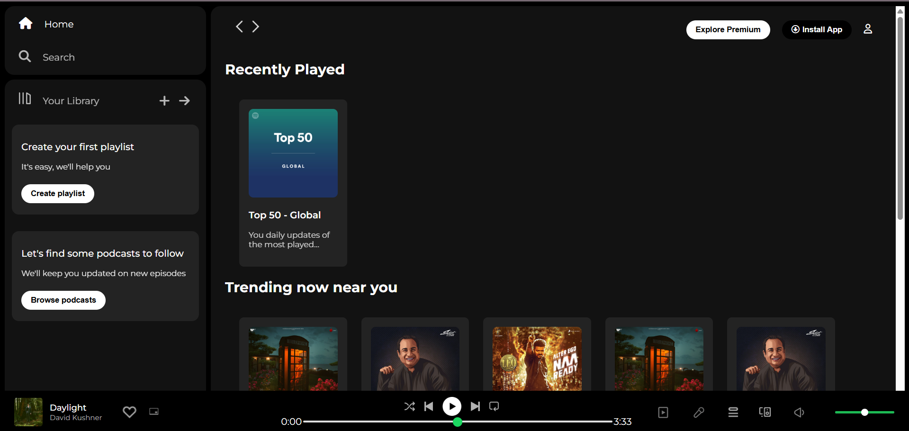

# 🎵 Spotify Clone (HTML & CSS)

A **static** front-end replica of the Spotify web player interface, built purely with **HTML5** and **CSS3**.  
This project focuses entirely on **UI design** — there is **no music playback functionality**.

---

## 📸 Preview


---

## 🚀 Live Demo
[View on GitHub Pages](https://NeerajGupta-dev.github.io/spotify-clone-html-css/)

---

## 📂 Features
- Spotify-inspired **responsive layout**
- Sidebar navigation and library section
- Playlist and album card grid
- Static music player bar with controls
- Styled using **pure CSS** (no frameworks)
- **Font Awesome** icons for realistic look

---

## 🛠️ Built With
- **HTML5**
- **CSS3**
- **Google Fonts** (Montserrat)
- **Font Awesome** icons

---

## 📌 How to Use
1. **Clone this repository**
   ```bash
   git clone https://github.com/NeerajGupta-dev/spotify-clone-html-css.git
